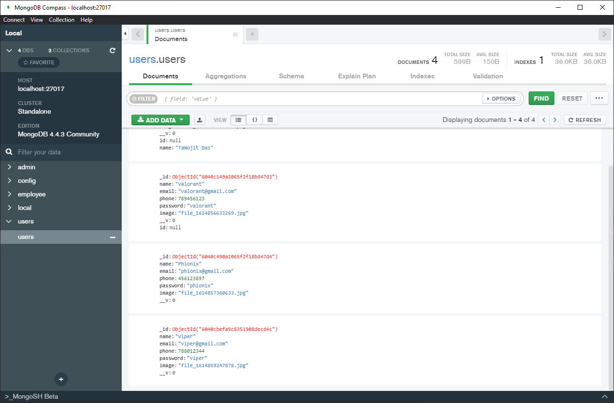

##### User Information using MongoDB

##### User information contains:
- ID
- Name
- Email address
- Phone Number
- Password
- Profile Picture

##### Functionality:
- Implementation CRU - Create Read Update functionality.
- Used bootstrap form to enter user details (id,name, email, phone number, password and profile picture).
- Used javascript function to upload profile picture of max-size 2MB.

```javascript
function ValidateSize(file) {
    const FileSize = file.files[0].size / 1024 / 1024; // in MiB
    if (FileSize > 2) {
        alert('File size exceeds 2 MiB');
        $(file).val(''); //for clearing with Jquery
    } else {

    }
}
```

- Used MongoDb store and retrieve data locally.
  
- Used JWT tokens to get user records.
- Used mongoose for mongodb implementation (connect db, create collections and schemas).

```javascript
const mongoose = require('mongoose');
mongoose.connect('mongodb://localhost:27017/users', {useNewUrlParser: true});
const conn = mongoose.Collection;
```

- Ejs for HTML in javascript template.
- Used Express framework.
- Morgan for HTTP request.
- Multer for uploading files.
- Nodemon to run the application.

##### install mongo db compass and connect 

```
localhost:27017
```

##### Run
run the code on the terminal 
```BASH
npm run
```
then open localhost:3000 to see the application.
```
localhost:3000
```

I added some sample images in ./images folder some are more than 2mb some are less than 2mb file size.